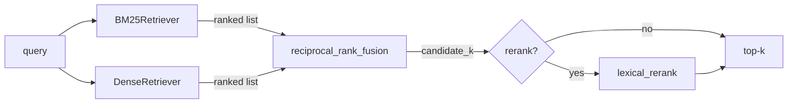
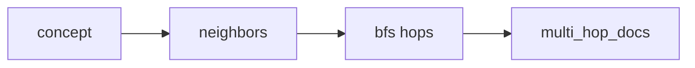

# Architecture

How a query flows through the system, and why each piece exists.

## Retrieval pipeline

1. **BM25** (`retrieval/bm25.py`) scores documents by exact term overlap (Okapi BM25
   over content tokens). Strong for keyword and acronym queries (`BM25`, `nDCG`).
2. **Dense** (`retrieval/dense.py`, `retrieval/embeddings.py`) embeds query and
   documents into a 256-dim L2-normalized vector via the **hashing trick** over word
   tokens *and* character 3-grams, then ranks by cosine. The char-n-grams provide a
   morphological / fuzzy signal (`rank`≈`ranking`) that BM25 lacks. Deterministic, so
   the benchmark is reproducible without downloading a model.
3. **Reciprocal Rank Fusion** (`retrieval/fusion.py`) merges the two ranked lists by
   `sum(1 / (k0 + rank))`. Operating on ranks (not raw scores) sidesteps the problem
   that BM25 scores and cosine scores live on incomparable scales.
4. **Lexical rerank** (optional) re-orders the fused candidate pool by Jaccard token
   overlap with the query — a cheap precision boost on the short list.

## Graph retrieval

`graph/property_graph.py` holds a directed labeled graph built from `data/triples.jsonl`.
`documented_in` edges link concepts to their corpus documents and are **excluded from
traversal** so BFS walks the conceptual relationships only; documents are gathered at
the end via `documents_for`. This answers multi-hop questions ("what underpins hybrid
search, two hops out?") that single-vector retrieval handles poorly.

## Benchmark + gate

`benchmark/runner.py` runs every system (bm25, dense, hybrid, hybrid+rerank) against
`data/qrels.jsonl` and computes recall@k, MRR, and nDCG@k (`benchmark/metrics.py`).
The CI gate (`run_benchmark().passed()`) requires hybrid recall@5 ≥ 0.80, nDCG@5 ≥ 0.60,
and that hybrid is no worse than either component on recall. `benchmark/report.py`
renders the markdown/console report. Numbers are always measured — never hardcoded.

## MCP surface

`mcp/connector.py` wraps the hybrid retriever and graph as two Model Context Protocol
tools — `hybrid_search` and `multi_hop` — with JSON schemas and a `call_tool` dispatch,
ready to register with the official MCP server SDK. Kept dependency-free so it runs and
tests offline.
